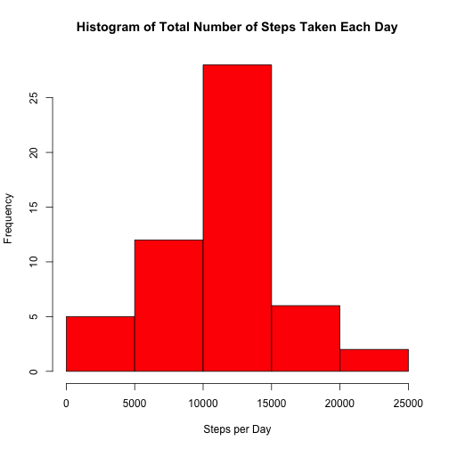
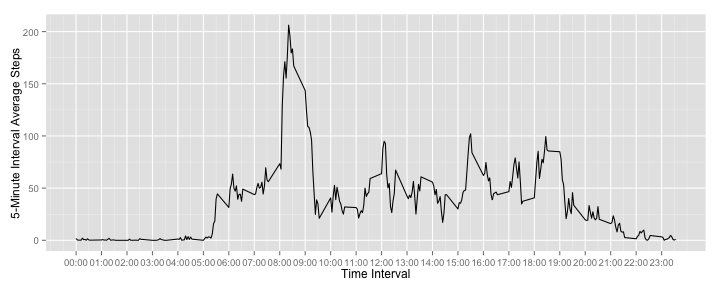
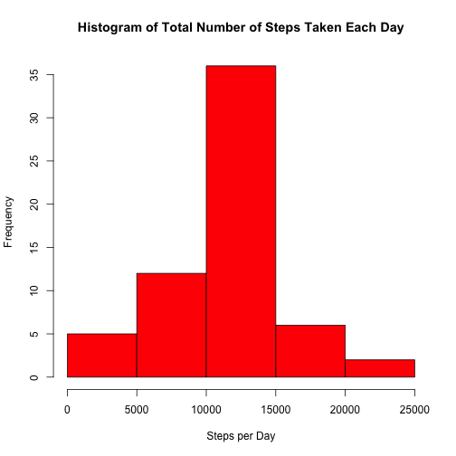

## Peer Assignment 1 - Reproducible Research


```r
echo=TRUE #makes the code visible 
```

Set up your working directory using setwd function.  
Example of the function is:
setwd("~/Desktop/Reproducible Research/Assignment 1")

The following code will check if the data file is already present and if not, will download and unzip the file.


```r
if (!file.exists("activity.zip")){
    download.file("https://d396qusza40orc.cloudfront.net/repdata%2Fdata%2Factivity.zip",
                  "activity.zip",method="curl")
}

if (!file.exists("activity.csv")){
    unzip("activity.zip")
}
```

### Loading and preprocessing the data  

Load the data and store them in a dataframe called activity.


```r
activity <- read.csv("activity.csv",stringsAsFactors=FALSE)
```

Let's look at the summary of the dataset


```r
summary(activity)
```

```
##      steps            date              interval     
##  Min.   :  0.00   Length:17568       Min.   :   0.0  
##  1st Qu.:  0.00   Class :character   1st Qu.: 588.8  
##  Median :  0.00   Mode  :character   Median :1177.5  
##  Mean   : 37.38                      Mean   :1177.5  
##  3rd Qu.: 12.00                      3rd Qu.:1766.2  
##  Max.   :806.00                      Max.   :2355.0  
##  NA's   :2304
```

The variables included in this dataset are:  
* steps: Number of steps taking in a 5-minute interval (missing values are coded as NA)  
* date: The date on which the measurement was taken in YYYY-MM-DD format  
* interval: Identifier for the 5-minute interval in which measurement was taken  
  
  
### What is mean total number of steps taken per day?

As we saw from the the structure, there are missing values that have to be omitted to complete this step (as requested).
For this purpose, a new dataset will be created.


```r
activity_complete <- na.omit(activity)
```

Let's look at the summary of the new dataset.


```r
summary(activity_complete)
```

```
##      steps            date              interval     
##  Min.   :  0.00   Length:15264       Min.   :   0.0  
##  1st Qu.:  0.00   Class :character   1st Qu.: 588.8  
##  Median :  0.00   Mode  :character   Median :1177.5  
##  Mean   : 37.38                      Mean   :1177.5  
##  3rd Qu.: 12.00                      3rd Qu.:1766.2  
##  Max.   :806.00                      Max.   :2355.0
```
There are no missing values.  
  
  
#### 1. Calculate the total number of steps taken per day  

To calculate the total number of steps taken per day we need to aggregate the data.


```r
stepsPerDay <- aggregate(steps ~ date,data=activity,FUN=sum)
```

#### 2. Make a histogram of the total number of steps taken each day.  
Difference between a Bar Chart and a Histogram:  
(http://stattrek.com/statistics/charts/histogram.aspx)  

A bar chart is made up of columns plotted on a graph. Here is how to read a bar chart.  
- The columns are positioned over a label that represents a categorical variable.  
- The height of the column indicates the size of the group defined by the column label.    

Like a bar chart, a histogram is made up of columns plotted on a graph. Usually, there is no space between adjacent columns. Here is how to read a histogram.  
- The columns are positioned over a label that represents a quantitative variable.  
- The column label can be a single value or a range of values.  
- The height of the column indicates the size of the group defined by the column label.  

Let's create the histogram.  


```r
hist(stepsPerDay$steps,col="red",xlab="Steps per Day", 
     main="Histogram of Total Number of Steps Taken Each Day")
```

 

#### 3. Calculate and report the mean and median of the total number of steps taken per day


```r
mean(stepsPerDay$steps)
```

```
## [1] 10766.19
```

```r
median(stepsPerDay$steps)
```

```
## [1] 10765
```

The mean and median of the total number of steps taken each day are very close.  


### What is the average daily activity pattern?

#### 1. Make a time series plot (i.e. type = "l") of the 5-minute interval (x-axis) and the average number of steps taken, averaged across all days (y-axis)  

First we need to aggregate the data.  
The interval varibale represents the numeric version of the hour, to create the right hour appearance we need to:  
- Build a string of 4 characters filling the empty spaces with 0s.  
- Convert the string into time.  
- Format the time using only the hour.  


```r
stepsPerInterval <- aggregate(steps ~ interval,data=activity_complete,FUN=mean)
stepsPerInterval$time <- formatC(stepsPerInterval$interval,width=4,flag=0)
stepsPerInterval$time <- strptime(stepsPerInterval$time,"%H%M")
stepsPerInterval$time <- format(stepsPerInterval$time, format="%H:%M")
```

Let's create the plot. In order to have only the hours appear on the x-axis we need to intervene on the scale breaking it by hours and labeling consequently (the 24*12 is due to the fact that the interval has 12 values per each hour).


```r
library(ggplot2)
```

```
## Warning: package 'ggplot2' was built under R version 3.1.2
```

```r
ggplot(stepsPerInterval,aes(x=interval,y=steps)) + geom_line(aes(group=1)) + 
    scale_x_continuous(breaks=stepsPerInterval$interval[seq(1,24*12,12)], 
                       labels=stepsPerInterval$time[seq(1,24*12,12)]) + ylab("5-Minute Interval Average Steps") + xlab("Time Interval")
```

 

#### 2. Which 5-minute interval, on average across all the days in the dataset, contains the maximum number of steps?


```r
stepsPerInterval[which.max(stepsPerInterval$steps),"time"]
```

```
## [1] "08:35"
```

### Imputing missing values

As we saw before, there are a number of days/intervals where there are missing values (coded as NA). The presence of missing days may introduce bias into some calculations or summaries of the data.  
  
#### 1. Calculate and report the total number of missing values in the dataset  


```r
sum(is.na(activity$steps))
```

```
## [1] 2304
```

#### 2. Devise a strategy for filling in all of the missing values in the dataset. The strategy does not need to be sophisticated. For example, you could use the mean/median for that day, or the mean for that 5-minute interval, etc.  

The mean and median were extremely close, we can select the mean.

Let's create a new dataset where we will fill the missing values with the corresponding mean of the same interval.  
  
For each row where there is a missing value, the function will check waht is the corresponding interval and will subsistute the missing number of steps with the average mean of steps for the corresponding interval.

#### 3. Create a new dataset that is equal to the original dataset but with the missing data filled in.


```r
activity_full <- activity

for(i in 1:nrow(activity_full)) {
    if( is.na(activity_full$steps[i]) == TRUE) {
        val <- activity_full$interval[i]
        activity_full$steps[i] <- stepsPerInterval[stepsPerInterval$interval==val,"steps"]  
    }   
}
```


#### 4. Make a histogram of the total number of steps taken each day and Calculate and report the mean and median total number of steps taken per day. Do these values differ from the estimates from the first part of the assignment? What is the impact of imputing missing data on the estimates of the total daily number of steps?


```r
steps_full <- aggregate(steps ~ date,data=activity_full,FUN=sum)

hist(steps_full$steps,col="red",xlab="Steps per Day", 
     main="Histogram of Total Number of Steps Taken Each Day")
```

 

The histogram of the dataset with the imputed missing values looks like very similar to the histogram of the dataset that omits the missing values.


```r
mean(steps_full$steps)
```

```
## [1] 10766.19
```

```r
median(steps_full$steps)
```

```
## [1] 10766.19
```

The mean is the same and now the median is also equal to the mean.  

### Are there differences in activity patterns between weekdays and weekends?

For this part, we will use the dataset with the filled-in missing values.

#### 1. Create a new factor variable in the dataset with two levels – “weekday” and “weekend” indicating whether a given date is a weekday or weekend day.  

Let's start converting the date in the appropriate format and creating a new variable withthe corresponding day of the week.


```r
activity_full$date <- strptime(activity_full$date,"%Y-%m-%d")

activity_full$day <- weekdays(activity_full$date)
```

Now let's create the variable and the convert it into factor.


```r
activity_full$daytype <- ifelse((activity_full$day=="Saturday") | (activity_full$day=="Sunday"),"weekend", "weekday")
activity_full$daytype <- as.factor(activity_full$daytype)
```

#### 2.Make a panel plot containing a time series plot (i.e. type = "l") of the 5-minute interval (x-axis) and the average number of steps taken, averaged across all weekday days or weekend days (y-axis). See the README file in the GitHub repository to see an example of what this plot should look like using simulated data.

Let's use the reshape2 package to create the melted dataset and then reshapes it using the mean function.  


```r
library(reshape2)
```

```
## Warning: package 'reshape2' was built under R version 3.1.2
```

```r
activity_melt <- melt(activity_full, measure.vars="steps")
steps_day <- dcast(activity_melt, daytype+interval~variable, mean)
```

We can now create the plot. The plot shown in the README was built with the lattice packege. Let's do the same.


```r
library(lattice)
```

```
## Warning: package 'lattice' was built under R version 3.1.2
```

```r
xyplot(steps ~ interval | daytype, data=steps_day,type="l",layout=c(1,2),xlab="Interval",
       ylab="Number of steps")
```

 

It seems that during the weekend the average number of steps is higher. 
